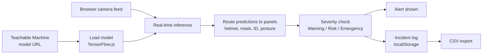

# SafeShift: Multi-Modal Worker Safety Monitor


A browser-based computer vision system for real-time workplace safety monitoring. SafeShift uses an 8-class Teachable Machine image classifier running on TensorFlow.js to check PPE, ID badge and posture compliance from a live camera feed, with real-time alerts and incident logging.

**Live demo:** https://safeshift.edgeone.dev/


---

## Overview

Workplace safety incidents often stem from delayed detection: a missed hard hat, an unnoticed badge violation, a moment of risky posture that nobody is watching. SafeShift runs lightweight AI inference directly in the browser, so real-time safety monitoring needs no heavy backend infrastructure.

## Key Features

- **Helmet detection.** Flags missing protective headgear.
- **Mask detection.** Monitors mask compliance.
- **ID badge verification.** Detects missing or unworn badges.
- **Posture monitoring.** Flags incorrect or risky posture.
- **Severity-tiered alerts.** Warning, Risk and Emergency classification.
- **Incident logging.** Timestamped event log with filters for All, Warn, Risk and Emergency.
- **CSV export.** Download incident history for reporting and audit.
- **Local persistence.** Incident data is saved in the browser with `localStorage`.
- **Shared camera feed.** A single camera stream powers all four detection panels.

## Detection Panels

| Panel | Classes detected | Purpose |
|---|---|---|
| Helmet | with helmet, without helmet | PPE headgear compliance |
| Mask | with mask, without mask | Mask compliance |
| ID badge | with id, without id | Badge verification |
| Posture | correct pose, incorrect pose | Risky posture detection |

## How It Works



1. A Teachable Machine model URL is loaded into the app.
2. The browser camera feed is passed through the TensorFlow.js runtime for real-time inference.
3. Predictions are routed to the relevant safety panel: helmet, mask, ID or posture.
4. Alerts are triggered from the classification results and severity thresholds.
5. Events are timestamped, stored locally and available for CSV export.

> **Note:** distress and audio monitoring is represented as a demo sensor in the current build, because the supplied model does not include an audio class.

## Screenshots


## Model Schema

The system expects an **8-class Teachable Machine image classifier** trained on these pairs:

| Compliant | Non-compliant |
|---|---|
| with helmet | without helmet |
| with mask | without mask |
| with id | without id |
| correct pose | incorrect pose |

## Tech Stack

| Layer | Technology |
|---|---|
| Frontend | HTML, CSS, JavaScript |
| AI / ML | TensorFlow.js, Teachable Machine |
| Storage | Browser `localStorage` |
| Hosting | Static web hosting |

## Getting Started

### Prerequisites

- A modern browser with camera access (Chrome, Edge or Firefox recommended)
- A trained Teachable Machine image classification model (8 classes, see the schema above) hosted and reachable by URL
- Node.js, only if you want to use `npx serve` for local hosting

### Run locally

```bash
git clone https://github.com/swethakannan595-crypto/SafeShift.git
cd SafeShift

# Serve locally (any static server works)
npx serve .
```

### Use the app

1. Open the local server URL in your browser.
2. Paste your Teachable Machine model URL into the app.
3. Click **Load Model**.
4. Click **Start Camera** to begin monitoring.

## Limitations

- Runs in demo mode until a valid model URL is supplied.
- Supports a single shared camera feed per session.
- Detection accuracy depends on the quality of the underlying Teachable Machine model.
- Incident history is stored only in the current browser, so it is not shared across devices.

## Roadmap

- [ ] Improve detection accuracy with a more robust, custom-trained model
- [ ] Add true audio-based distress detection
- [ ] Support multiple cameras and stations
- [ ] Add backend integration for centralized incident reporting

## Author

**Swetha Kannan**
[GitHub](https://github.com/swethakannan595-crypto)

Feedback and suggestions are welcome.

## License

Released under the MIT License. See [LICENSE](LICENSE) for details.
